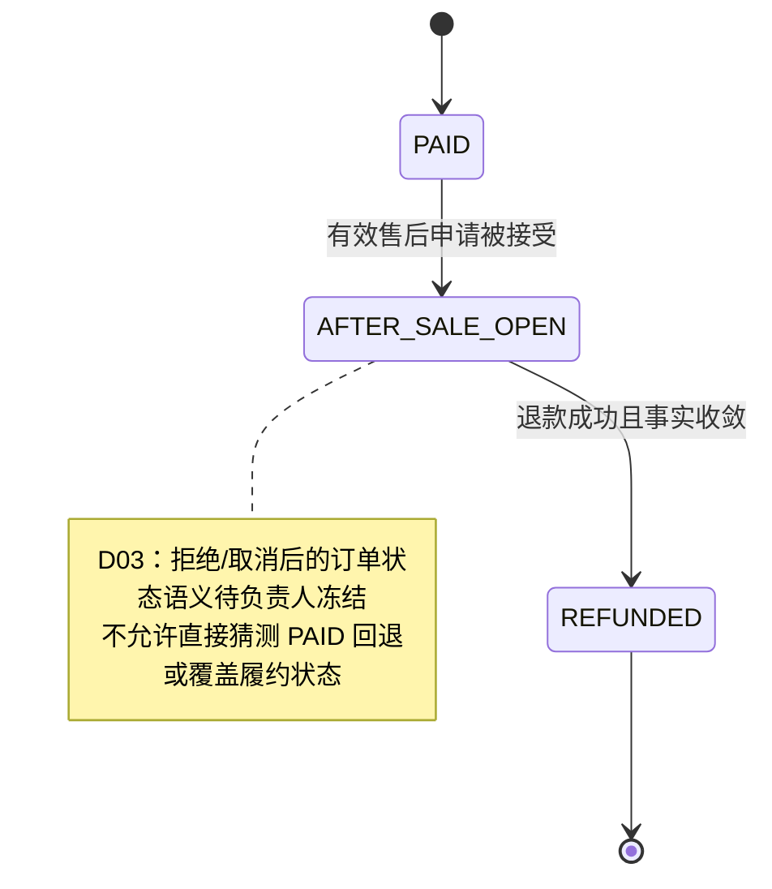
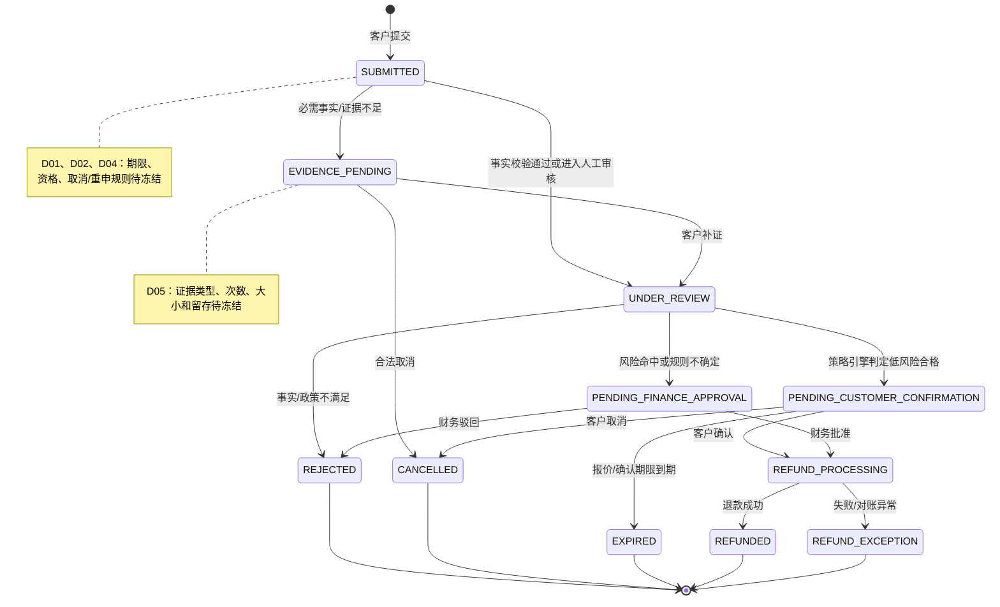
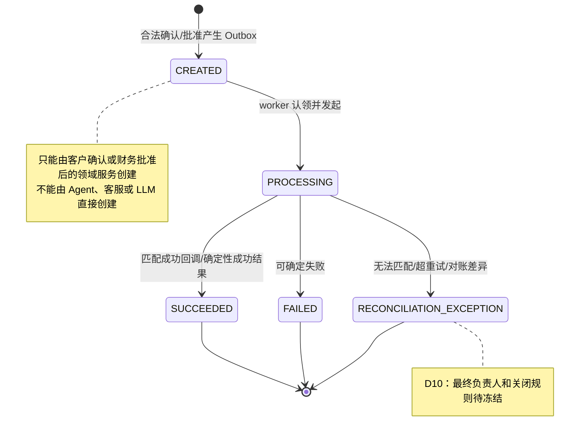
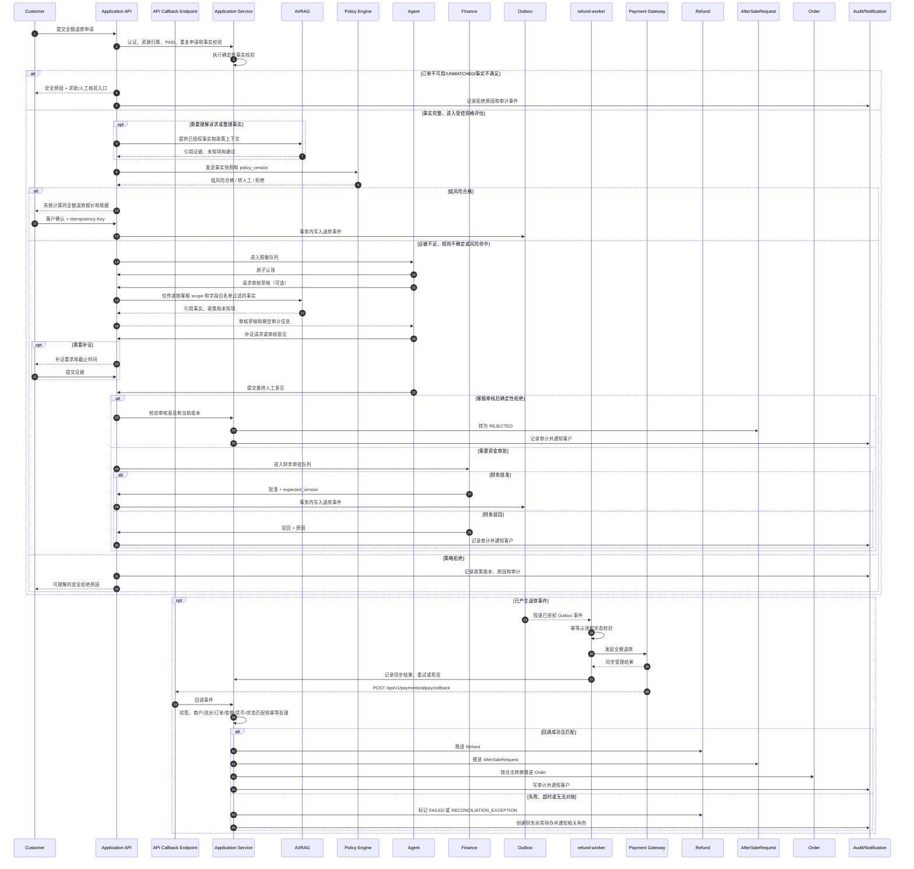

# S0-02：角色矩阵、状态机与退款时序图

状态：待负责人冻结
依赖：`S0-01_PRD_REFUND_WORKBENCH.md`、PLAN_V6 0.4/0.5
范围：只冻结业务契约，不实现 API、数据库、支付或退款接口

## 1. 角色矩阵

| 角色 | 数据范围 | 允许命令/动作 | 禁止事项 | 必须记录 | 关联未决决策 |
|---|---|---|---|---|---|
| `customer` | 自己已确认归属的订单、售后申请、证据和状态 | 创建/取消自己的申请；补证；确认自动退款报价；查看进度 | 查看他人数据；审批或执行退款；填写退款金额 | 申请事实、证据、确认时间、展示报价和状态 | D01、D04、D11 |
| `agent` | 脱敏未认领队列；认领后仅限当前申请审核所需字段 | 原子认领；释放认领；请求补证；提交审核意见；查看白名单字段 | 批准资金；调用支付；查看其他客服完整数据；修改订单/支付事实 | 认领/释放、AI 原始建议、人工修改、最终意见、证据引用 | D05、D08 |
| `finance` | `PENDING_FINANCE_APPROVAL` 及关联订单、支付、退款、审核和风险事实 | 批准/驳回；处理退款失败和对账异常；授权重试 | 修改订单金额或退款结果；管理用户/角色；绕过幂等和版本校验 | 审批意见、审批人、版本、重试原因、异常关闭记录 | D06、D07、D10 |
| `operator` | 退款政策/商品规则；脱敏聚合运营数据 | 创建/测试/提交发布/维护具体政策；查看模拟和趋势结果 | 查看完整 PII；审批/执行退款；修改价格、支付事实、订单状态 | 政策版本、创建/审核/发布/回滚操作、模拟结果 | D02、D09、D12 |
| `admin` | 用户、角色授权、策略系统配置、脱敏审计元数据 | 管理账号/角色授权；配置策略系统框架、权限和开关；查看审计元数据 | 创建/审核/发布/回滚具体退款政策；处理售后；审批/执行退款；紧急越权 | 授权变更、配置变更、审计查询 | D09 |
| `refund-worker` | 仅已授权退款 Outbox 事件及关联 Refund | 认领 Outbox；调用支付适配器；处理同步受理结果；重试/死信 | 作为公网回调入口；创建申请；决定资格/金额；绕过审批/确认；直接改订单或用户 | 事件 ID、幂等键、尝试次数、外部流水、结果和错误 | D06、D07、D10 |

共同约束：所有命令同时经过角色授权、资源范围、合法状态、幂等键和并发版本校验；状态变更由应用服务完成并写审计事件。`admin` 不是日常业务超级用户，也不存在首版 break-glass。

## 2. 状态机一：Order

以下只记录 PLAN_V6 0.5 已冻结的转换，不为拒绝、取消或过期擅自增加回退转换。

约束：退款成功前不能进入 `REFUNDED`；申请拒绝、取消或过期不能被解释为退款成功。订单支付/履约事实与售后申请状态的持久化关系属于 D03。

## 3. 状态机二：AfterSaleRequest

低风险申请可以由应用服务触发策略资格评估，不要求先经过客服；客服只处理证据不足、规则不确定、风险命中或明确人工介入的申请。AI 不改变任何转换条件。

## 4. 状态机三：Refund

退款金额必须由可信支付事实计算，不能来自客户、客服、Agent 或 LLM 的自由输入。金额最小单位、货币、支付流水和已退款金额的唯一来源由 D06 冻结。

## 5. 退款时序图

支付平台异步回调只能进入 API callback endpoint（PLAN_V6：`POST /api/v1/payments/alipay/callback`）；由应用服务完成验签、商户/外部流水/订单/金额/货币/状态校验、幂等处理和领域状态更新。`refund-worker` 不作为公网回调入口。

## 6. 12 项未决决策登记

以下只记录负责人需要冻结的位置与影响，不填数值、不替负责人改变 PLAN_V6 规则。

| 编号 | 待负责人冻结的位置 | 影响 |
|---|---|---|
| D01 | 申请时限、已履约/未履约定义、已支付唯一事实来源 | 订单资格校验、客户提示、策略输入和测试样例 |
| D02 | 自动资格金额阈值、风险条件、排除商品/原因、报价有效期、政策发布人 | 自动路径是否成立、转财务条件、策略版本和运营职责 |
| D03 | `Order.AFTER_SALE_OPEN` 与售后申请的持久化关系；拒绝/取消后的订单语义 | Order/AfterSaleRequest 数据模型、状态转换和查询接口 |
| D04 | 客户可取消状态、补证次数/截止时间、过期后的重新申请、UNMATCHED 核验后续 | 客户命令、状态机、通知和人工核验流程 |
| D05 | 字段白名单、证据类型/格式/大小/留存、AI 修改审计展示 | 客服详情、对象存储、数据分级和审计字段 |
| D06 | 金额最小单位、货币范围、支付流水与已退款金额唯一来源、全额公式 | 金额模型、策略输入、支付请求和防超额退款校验 |
| D07 | 审批人与申请处理人的分离、双人审批和特殊风险复核 | Finance 命令、expected_version、审批记录和权限矩阵 |
| D08 | 客服自释放/超时回收 SLA、离职回收、主管转派角色 | claim/release 命令、队列防卡死和审计 |
| D09 | 政策创建/审核/发布/回滚的角色分工和模拟发布门槛 | Operator/Admin 权限、政策生命周期和回滚流程 |
| D10 | 支付失败、回调异常、对账差异的最终关闭队列与责任人 | 异常状态、重试/死信、通知和运营报表 |
| D11 | 通知渠道、模板、脱敏支付渠道展示和各状态 SLA | 客户体验、通知任务、超时与人工接管 |
| D12 | 采用率、处理时长、自动资格率等指标的统计口径和基线 | 运营报表、AI 价值判断和发布验收 |

S0-02 只完成契约整理；D01–D12 未冻结前，不进入业务实现，不创建表，不接支付或退款接口。
