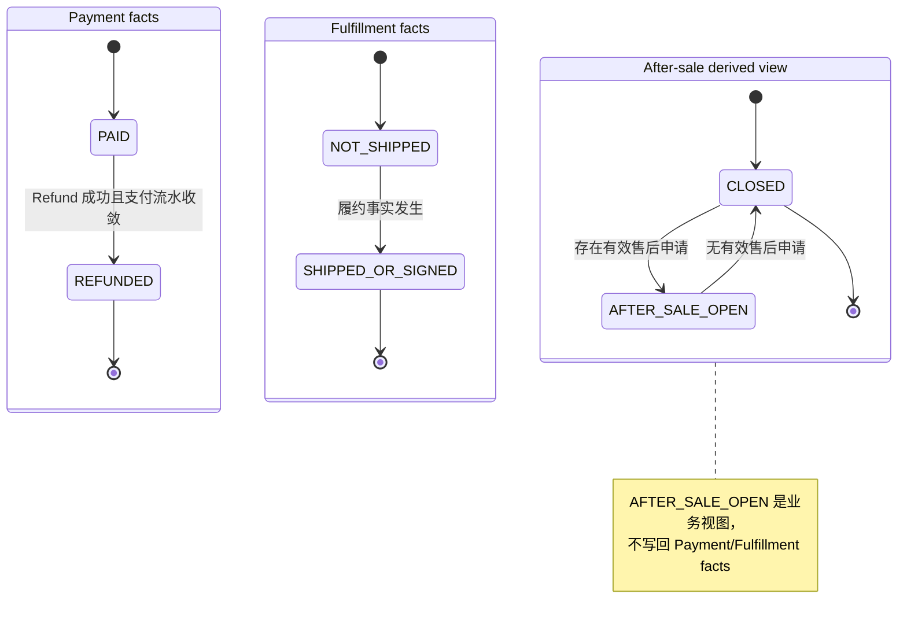
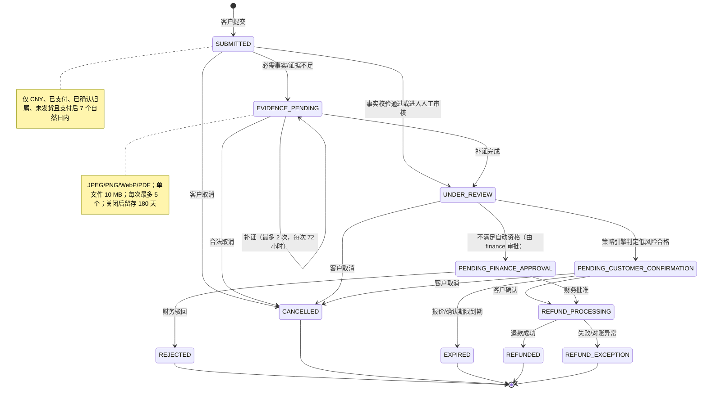
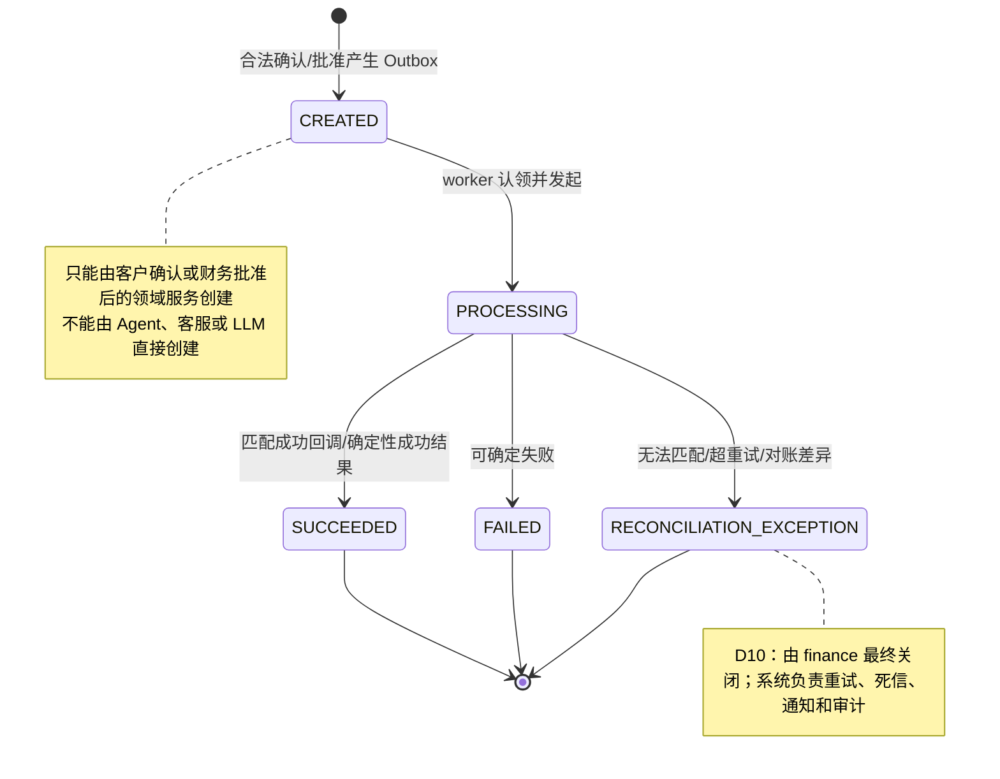
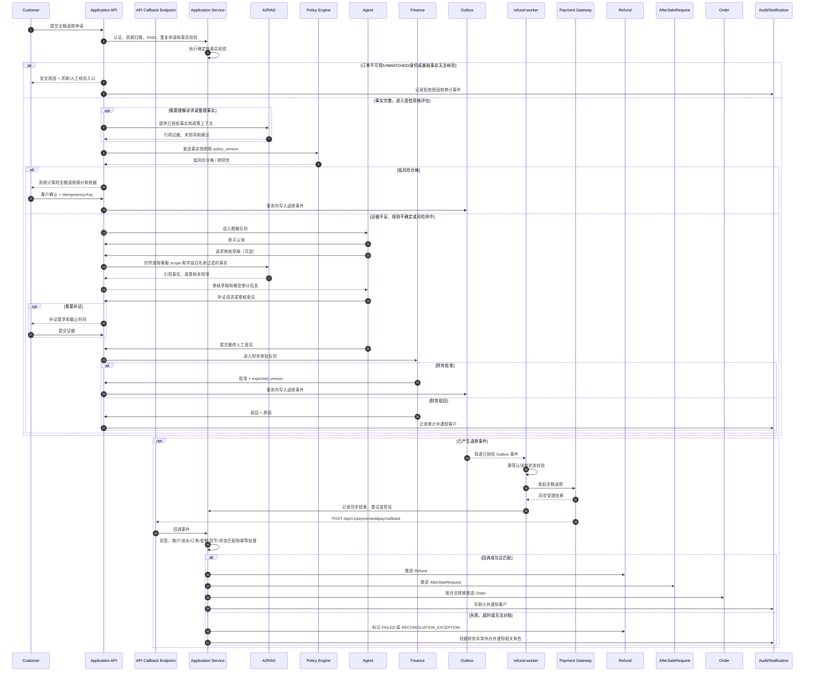

# S0-02：角色矩阵、状态机与退款时序图

状态：负责人已冻结
依赖：`S0-01_PRD_REFUND_WORKBENCH.md`、PLAN_V6 0.4/0.5
范围：只冻结业务契约，不实现 API、数据库、支付或退款接口

冻结依据：`S0_DECISION_RECORD.md`

## 1. 角色矩阵

| 角色 | 数据范围 | 允许命令/动作 | 禁止事项 | 必须记录 | 关联冻结决策 |
|---|---|---|---|---|---|
| `customer` | 自己已确认归属的订单、售后申请、证据和状态 | 创建/取消自己的申请；补证；确认自动退款报价；查看进度 | 查看他人数据；审批或执行退款；填写退款金额 | 申请事实、证据、确认时间、展示报价和状态 | D01、D04、D11 |
| `agent` | 脱敏未认领队列；认领后仅限当前申请审核所需字段 | 原子认领；释放认领；请求补证；提交审核意见；查看白名单字段 | 批准资金；调用支付；查看其他客服完整数据；修改订单/支付事实 | 认领/释放、AI 原始建议、人工修改、最终意见、证据引用 | D05、D08 |
| `finance` | `PENDING_FINANCE_APPROVAL` 及关联订单、支付、退款、审核和风险事实 | 批准/驳回；处理退款失败和对账异常；授权重试；最终关闭资金异常 | 修改订单金额或退款结果；管理用户/角色；绕过幂等和版本校验；审批自己提交过客服审核意见的申请 | 审批意见、审批人、版本、重试原因、异常关闭记录 | D06、D07、D10 |
| `operator` | 退款政策/商品规则；脱敏聚合运营数据 | 创建/测试/提交发布/维护具体政策；创建/测试与审核/发布由不同 operator 身份完成；查看模拟和趋势结果 | 查看完整 PII；审批/执行退款；修改价格、支付事实、订单状态；职责分离不满足时发布新政策 | 政策版本、创建/审核/发布/回滚操作、模拟结果 | D02、D09、D12 |
| `admin` | 用户、角色授权、策略系统配置、脱敏审计元数据 | 管理账号/角色授权；配置策略系统框架、权限和开关；查看审计元数据 | 创建/审核/发布/回滚具体退款政策；处理售后；审批/执行退款；紧急越权 | 授权变更、配置变更、审计查询 | D09 |
| `refund-worker` | 仅已授权退款 Outbox 事件及关联 Refund | 认领 Outbox；调用支付适配器；处理同步受理结果；重试/死信 | 作为公网回调入口；创建申请；决定资格/金额；绕过审批/确认；直接改订单或用户 | 事件 ID、幂等键、尝试次数、外部流水、结果和错误 | D06、D07、D10 |

共同约束：所有客户/内部角色命令同时经过角色授权、资源范围、合法状态、幂等键和并发版本校验；支付 callback 不使用 `Idempotency-Key`，使用外部事件标识、商户退款请求号和外部退款流水的唯一组合去重。状态变更由应用服务完成并写审计事件。`admin` 不是日常业务超级用户，也不存在首版 break-glass。

## 2. 状态机一：Order

以下记录三个相互分离的事实域。支付状态、履约状态和售后状态分别保存；`AFTER_SALE_OPEN` 只由有效售后申请推导，不覆盖支付或履约事实。

约束：退款成功前不能进入支付事实 `REFUNDED`；申请拒绝、取消或过期不能被解释为退款成功，也不能覆盖履约事实。已发货/已签收订单不进入首版退款闭环，转人工售后。

## 3. 状态机二：AfterSaleRequest

低风险申请可以由应用服务触发策略资格评估，不要求先经过客服。只有事实完整、未发货、无重复有效申请、无历史异常且全额退款不超过 2000 CNY 时才进入客户确认；其他退款一律进入 `PENDING_FINANCE_APPROVAL`。客户仅可在 `SUBMITTED`、`EVIDENCE_PENDING`、`UNDER_REVIEW`、`PENDING_CUSTOMER_CONFIRMATION` 取消；`CANCELLED` 可在原 7 个自然日内重新申请一次，`REJECTED`/`EXPIRED` 后只能走人工核验/客服入口。AI 不改变任何转换条件。

## 4. 状态机三：Refund

退款金额必须由支付流水计算，不能来自客户、客服、Agent 或 LLM 的自由输入。金额使用“分”的整数，仅支持 CNY；可退余额 = 原支付金额 - 已成功退款金额 - 已创建/处理中的退款保留金额。

## 5. 退款时序图

支付平台异步回调只能进入 API callback endpoint（PLAN_V6：`POST /api/v1/payments/alipay/callback`）；由应用服务完成验签、商户/外部流水/订单/金额/货币/状态校验和领域状态更新。callback 不使用 `Idempotency-Key`，以支付网关稳定外部事件标识、商户退款请求号和外部退款流水的唯一组合去重。`refund-worker` 不作为公网回调入口。支付失败、回调异常和对账差异由 `finance` 最终关闭；系统负责重试、死信、通知和审计。

## 6. 冻结决策索引

D01–D12 已由负责人接受，完整内容见 [`S0_DECISION_RECORD.md`](S0_DECISION_RECORD.md)。下表仅说明本状态机文档受影响的边界。

| 编号 | 已冻结规则 | 对本文件的影响 |
|---|---|---|
| D01 | 仅 CNY；已支付、已确认归属、未发货且支付后 7 个自然日内；已发货/签收转人工售后 | Order 资格、时序起点和客户分流 |
| D02 | 自动资格事实完整、未发货、无重复有效申请、无历史异常、全额退款不超过 2000 CNY；其余转 finance | `PENDING_CUSTOMER_CONFIRMATION` 与 `PENDING_FINANCE_APPROVAL` 分流 |
| D03 | 支付、履约、售后状态分开；`AFTER_SALE_OPEN` 为有效申请推导视图 | Order 状态机采用三类事实域，不覆盖支付/履约 |
| D04 | 四个状态可取消；补证最多 2 次、每次 72 小时；取消后原期限内可重申一次 | 取消、补证、自循环和终态规则 |
| D05 | JPEG/PNG/WebP/PDF；10 MB/文件；5 个/申请；关闭后 180 天；原始证据禁入日志/Prompt | Evidence 状态注释和数据边界 |
| D06 | 整数分、仅 CNY、支付流水唯一来源；可退余额扣除成功退款和处理中保留额 | Refund 金额与并发安全 |
| D07 | 审核意见人与审批人不得相同；不做双人审批；超出自动资格由单个 finance 审批 | 角色矩阵和审批 guard |
| D08 | 认领超过 24 小时且未进入财务审批/退款处理则自动回收；离职/主管转派线下 | claim/release 与队列回收 |
| D09 | operator 管理政策；创建/测试与审核/发布须不同 operator；不满足则保持 ACTIVE；admin 仅配置/授权 | 政策权限矩阵 |
| D10 | finance 最终关闭支付失败、回调异常、对账差异；系统负责重试/死信/通知/审计 | Refund 异常状态与时序责任 |
| D11 | 仅工作台通知/待办；补证 72 小时；客服/财务目标 24 小时；超时进异常队列 | 时序通知与人工接管 |
| D12 | 自动资格率、处理时长公式；AI 采用/修改/拒绝须显式选择；100 个关闭申请或 30 天后评估 | 审计字段和指标验收 |

S0-02 只完成契约整理；D01–D12 已冻结，但本文件不代表业务实现、数据库迁移、支付或退款接口已经完成。
